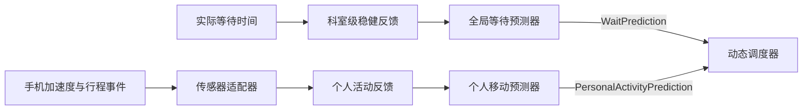

# V6：个人活动预测与手机加速度传感器接口

## 数据边界



- 实际等待时间描述科室当前排队系统，按 `department_id` 聚合，影响所有患者之后的等待预测。
- 实际活动时间描述某名患者从一个位置移动到另一个位置的速度，按 `patient_id` 学习，只影响该患者的路程时间。
- 检查设备真正被占用的服务时长仍可由 HIS/设备完成事件调用 `observe_service_completion(...)`，它不是“个人活动时间”。
- 调度器不读取原始反馈或传感器数据，只读取两个稳定契约：`WaitPrediction` 和 `PersonalActivityPrediction`。

## 个人活动模型

### 六类初始速度

患者尚无个人数据时，先按年龄段与性别使用以下可配置预设（单位：米/秒）：

| 年龄段 | 男 | 女 |
| --- | ---: | ---: |
| 青年（<40 岁） | 1.43 | 1.42 |
| 中年（40–59 岁） | 1.43 | 1.40 |
| 老年（≥60 岁） | 1.35 | 1.29 |

这些数值是工程初值，不是医学诊断阈值；上线前应根据医院建筑、患者构成和实测样本重新标定。
初值参考 Bohannon 对 20–79 岁成人舒适步速的分年龄、性别测量结果：
<https://pubmed.ncbi.nlm.nih.gov/9143432/>。

### 传感器反馈与逐步更新

科室间距离使用静态距离矩阵。手机加速度传感器用于识别有效步行段并取得步行时间；当行程同时带有距离时计算：

`实际步行速度（米/秒） = 距离（米） / 步行时间（秒）`

没有可靠距离时，继续兼容原计算：

`个人移动时间系数 = 实际活动分钟数 / 路线基准分钟数`

系数大于 1 表示比基准慢，小于 1 表示比基准快。默认按患者累计 3 次有效行程形成一个稳健微批：

1. 校验行程时长、距离、传感器置信度和事件幂等性；
2. 对同一患者的小批次使用中位数、MAD 和 IQR 抑制异常；
3. 用批次中位速度代表本批，避免单次异常行程直接改变画像；
4. 用 EWMA 渐进吸收变化，默认每批吸收 20%，并限制单次最大变化；
5. 每次画像更新后 `profile_version` 自增，同时累计距离和行程数；样本置信度随有效行程数提高。

预测器输出示例：

```python
PersonalActivityPrediction(
    patient_id="patient-001",
    generated_at=now,
    travel_time_factor=1.18,
    model_version="personal-activity-v2",
    sample_count=6,
    current_speed_mps=1.14,
    confidence=0.6,
    profile_version=3,
    total_distance_meters=820.0,
    total_trips=6,
)
```

`build_batch_schedule(...)`、`build_hybrid_schedule(...)` 和 `RollingHorizonScheduler.replan(...)` 均可接收 `activity_predictions={patient_id: prediction}`。同一条 5 分钟基准路线可以为行动较快者预测 4 分钟、行动较慢者预测 7 分钟，而等待预测仍保持科室级共享。

## 加速度传感器接口

后端预留了三个平台无关的数据契约：

- `AccelerometerSample`：采样时间和三轴 `x/y/z`；
- `AccelerometerBatch`：患者、起终点、行程时间窗、静态距离、基准时间和采样序列；
- `ActivitySensorAdapter`：把不同手机平台的采样批次转换成 `PersonalActivityFeedback`，也可以在信号不可靠时返回 `None`。

核心入口：

```python
result = personal_feedback_controller.ingest_sensor_batch(
    accelerometer_batch,
    wechat_sensor_adapter,
)
```

适配器负责运动段识别、手机姿态变化、暂停、采样缺失和置信度计算。控制器会再次校验事件 ID、患者 ID、起终点、采样时间顺序和有限数值，低于置信度门槛的数据不会进入个人模型。

### 微信小程序侧建议

小程序可在患者确认“开始前往下一科室”后开启加速度监听，在到达扫码或确认到达后停止。前端事件结构可对应：

```javascript
const samples = []

wx.startAccelerometer({ interval: 'normal' })
wx.onAccelerometerChange(({ x, y, z }) => {
  samples.push({
    captured_at: new Date().toISOString(),
    x,
    y,
    z,
  })
})

// 到达后调用 wx.stopAccelerometer()，再把 samples 与行程上下文提交后端。
```

正式前端实现时还应在页面卸载、切后台、用户拒绝权限和超时情况下停止监听并标记低置信度。

## 为什么不能只靠加速度确定活动时间

三轴加速度可以帮助判断手机是否在移动、运动节律是否连续，但不能单独可靠判断患者位于哪个科室，也难以区分“患者走路”和“手机被拿起晃动”。因此一条有效反馈还必须包含：

- 由当前调度状态、二维码、蓝牙信标或人工确认提供的 `origin_id` 与 `destination_id`；
- 开始和到达时间；
- 路线基准时间；
- 传感器适配器给出的置信度。

建议优先在客户端提取运动摘要，后端只保存行程时长、置信度和必要统计。原始高频传感器数据应设置短期保留时间，并取得用户授权，避免形成不必要的长期个人行为轨迹。

## 与实时调度衔接

当 `ActivityFeedbackUpdate.model_updated=True` 时，外层编排服务可以重新生成该患者的 `PersonalActivityPrediction`，并在下一次滚动周期传给调度器。反馈控制器本身不调用重排，个人预测器也不持有调度器。

等待模型采用“同科室至少 5 条反馈”的全局微批；个人活动模型采用“同患者至少 3 次有效行程”的个人微批。二者的缓冲、状态和更新频率完全独立。加速度数据只负责识别有效运动和步行时间；科室距离仍来自静态距离矩阵，避免把手机惯性导航误差累积进路线距离。
